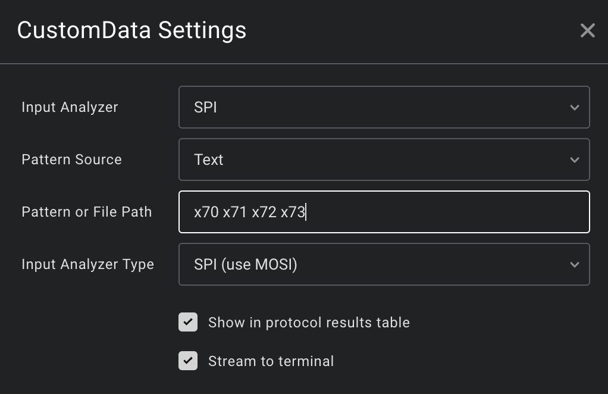

# _**Custom Data**_ - Saleae Logic2 High-level Analyzer

Custom Data is a flexible high-level analyzer (HLA) which can be configured to identify and
highlight data patterns in captured data.

Use Custom Data to annotate commands in your own protocol, without the need to create an entire HLA
yourself! Or search for specific patterns in long data streams effortlessly.

Custom Data uses a [custom language](#pattern-reference) to describe and annotate patterns. For
example, you could write patterns to describe the protocol of an (imaginary) display:

```
"Reset" = xFA ;
"Set Pixel: {r}, {g}, {b}" = xFD r:. g:. b:. ;
"Set X Pos: {xPos:B}" = xFB xPos:(..) ;
"Set Y Pos: {yPos:B}" = xFC yPos:(..) ;
```

Quick patterns can be added as a one-off string, or longer patterns for complex protocols can be
loaded from files for re-use across many sessions.

## Demo

Let's annotate some data in an SPI capture, from the MOSI side.

To start simple, we'll annotate the fixed four-byte sequence `0x70, 0x71, 0x72, 0x73`, by adding a
`CustomData` analyzer and entering the pattern `x70 x71 x72 x73`:



This creates an annotation on the relevant data:


However, we've not assigned a name to this pattern, so it currently shows as `(unnamed)`, which
isn't too useful.

We can assign a name using `"Foo" = x70 x71 x72 x73`:


Let's make the pattern more flexible, by pretending that in reality, this is a command-based format
where `0x70, 0x71` is the command, and the following two bytes are data.

Replacing the last two bytes with a wildcard `.` gives `"Foo" = x70 x71 ..`, and the result does not
change. Great!

But what if we'd like to see that data on the annotation?

We can capture it using `name:`, and then display it in the annotation using Python's formatting
syntax. Because `..` is really two separate wildcard patterns, we'll need to wrap them in
parentheses to capture both of them. Also, we can pretend that those two data bytes represent a
little endian integer, and use the `L` format specifier to convert for us.

This gives the pattern `"Foo: {data:L}" = x70 x71 data:(..)`, which results in...


## Pattern Reference

### Basics

- **Fixed bytes:** Match particular bytes by writing them out: `x7A x1B`
  - Supported formats are hexadecimal (`x`), decimal (`d`), and binary (`b`)
  - The base can be specified using the form `xAA`, `AAx`, or `0xAA` - whichever you prefer
  - `0` is special, and doesn't need a base
- **Wildcards:** Match any one byte with `.`
- **Grouping:** Treat a sequence of elements as one by wrapping them in parentheses. This isn't too
  useful on its own, but comes in handy for capturing multiple bytes.

### Naming and Captures

**Name** a pattern using `"Name" = pattern`, which will show in the resulting annotation: `"ASCII letter A" = 65`

**Capture** the result of one pattern element by prefixing it with `name:`: `01 data:.`

If you need to capture more than one element under the same name, use parentheses: `01 data:(....)`

Captured data can be interpolated into a name using standard Python formatting syntax: `"Send {x}" = 01 x:.`

The following formatting specifiers (usable with e.g. `{x:L}`) are supported:

- _Nothing_: Render as packed hex: `xABCDEF1234`
- `S`: Render as **s**paced hex: `xAB xCD xEF x12 x34`
- `L`: Interpret bytes as an unsigned **l**ittle-endian integer
- `B`: Interpret bytes as an unsigned **b**ig-endian integer

## Limitations

- HLAs written in Python can only look at one stream of data. This means Custom Data can't fully
  understand protocols which have some kind of external "command/data" signal, like some SPI
  devices.

- HLAs can't produce overlapping annotations. If there are any overlapping matches, Custom Data will
  drop them in favour of the one which finished first. If multiple matches finished at the same
  time, the one which also started first will be selected.

- Logic2 does not have very powerful parameters for analyzers, so it isn't possible to browse for a
  pattern file - you must paste an absolute path instead.

- Only protocols which transmit bytes as their atomic unit are currently supported.
  Longer words will not work; shorter words are untested but might be OK?

- Underlying protocols (e.g. Async Serial, SPI) must be individually supported, and few are yet!

## Development

This follows the standard Saleae HLA template, with some notable additions:

- There is a suite of unit tests, runnable with `pytest`.
- I've written some "good enough for VS Code" types for the `saleae` module, in the `typings`
  directory.
